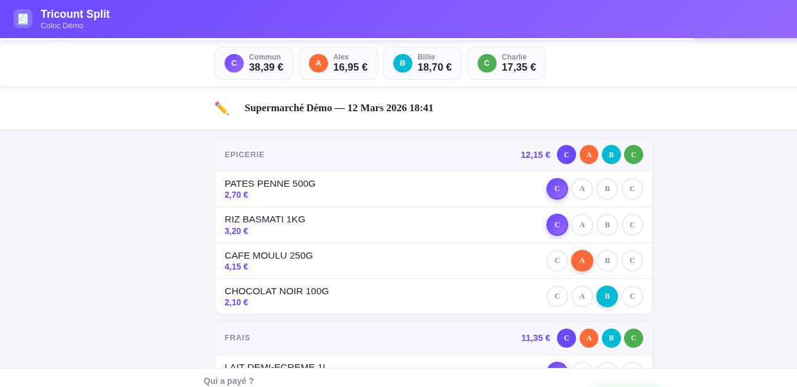
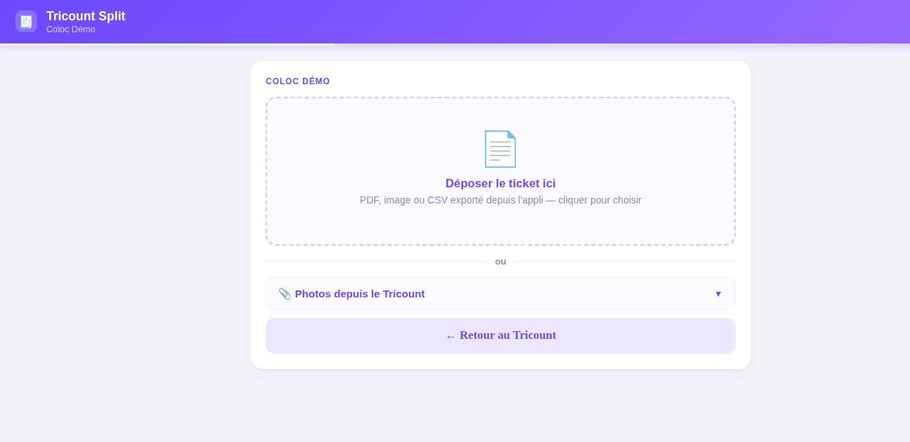

<h1 align="center">🧾 Tricount Scanner</h1>

<p align="center">
  Découper un ticket de caisse <strong>article par article</strong> et pousser la dépense
  dans un <a href="https://tricount.com">Tricount</a> — sans IA, sans service externe, sans compte à créer.
</p>

<p align="center">
  
</p>

---

## Le problème

Tricount partage une dépense de façon uniforme, ou avec des parts fixes. Or dans des courses
à trois, la moitié du ticket est commune (pâtes, lessive, papier toilette) et l'autre moitié
est personnelle (le dentifrice de l'un, la bière de l'autre). Recopier 40 lignes à la main
dans l'appli, personne ne le fait.

## Le principe

1. **Connexion au Tricount** via son lien de partage — l'API non publique de Tricount (bunq)
   est utilisée avec une paire de clés RSA générée localement (`credentials.json`, jamais versionnée).
2. **Import du ticket** : l'export PDF ou CSV que fournissent les applis d'enseigne
   (Mon E.Leclerc & co) contient une couche texte propre. `receipt_parser.py` la lit avec
   `pdfplumber` + des regex : **zéro OCR, zéro appel à une IA, zéro donnée qui sort de la machine.**
   Pour les enseignes sans export (Lidl…), `receipt_ocr.py` fait un OCR local via EasyOCR,
   valide la somme contre le total imprimé et signale explicitement le résultat comme à vérifier.
3. **Répartition** : chaque ligne est `Commun` par défaut ; un clic la bascule sur une personne.
   Les totaux par personne se recalculent en direct.
4. **Écriture dans Tricount** : une seule dépense est créée avec un *custom split*, où chacun doit
   `ses articles perso + sa part égale du commun`. Les arrondis sont absorbés par le dernier membre
   pour que la somme des parts tombe exactement sur le total du ticket.

Bonus : les dépenses existantes du Tricount peuvent être **re-découpées** après coup
(`/resplit`) en gardant la photo du ticket attachée à la transaction.

## Captures

| Vue d'ensemble du Tricount | Import du ticket |
|---|---|
|  |  |

| Répartition article par article | Confirmation |
|---|---|
|  |  |

> Toutes les captures proviennent du **mode démo** : membres, ticket et montants sont fictifs.

## Démo (hors ligne, sans Tricount)

```bash
pip install -r requirements.txt
python demo/demo_server.py     # http://localhost:8010
```

Le serveur de démo sert la vraie interface avec un Tricount fictif en mémoire
(Alex / Billie / Charlie) et **aucun appel réseau**. Le parsing, lui, est le vrai code :
déposez `samples/ticket_demo.csv` dans l'écran d'import pour dérouler tout le parcours.

## Utilisation réelle

L'application tourne sous **Windows, macOS et Linux**.

### Windows

Le plus simple : télécharger `TricountScanner.exe` depuis la page
[Releases](../../releases), le placer dans un dossier et le lancer. Au premier
démarrage il crée un fichier `.env` à côté de lui : collez-y le lien de partage
de votre Tricount, relancez, et l'interface s'ouvre dans le navigateur.

Depuis les sources :

```powershell
copy .env.example .env    # y coller le lien de partage de votre Tricount
py -3 -m pip install -r requirements.txt
run.bat                   # ou : py -3 launch.py
```

### macOS / Linux

```bash
cp .env.example .env      # y coller le lien de partage de votre Tricount
pip install -r requirements.txt
./run.sh                  # ou : python3 launch.py
```

Dans les deux cas l'application écoute sur `http://localhost:8000` et affiche
aussi son adresse sur le réseau local, pour l'ouvrir depuis le téléphone
(même Wi-Fi) et l'installer en PWA.

En fenêtre native plutôt que dans le navigateur : `python app.py`
(nécessite `pywebview` ; sous Windows, `pythonnet` et le runtime WebView2).

### OCR des tickets photo (optionnel)

Les exports PDF/CSV n'ont besoin de rien de plus. Pour lire une **photo** de
ticket, installez en plus `pip install -r requirements-ocr.txt` (~2 Go avec
PyTorch). Sans cela, l'import d'une image affiche simplement un message
expliquant d'utiliser un export PDF ou CSV.

## Architecture

| Fichier | Rôle |
|---|---|
| `main.py` | API FastAPI : connexion Tricount, création / édition / re-découpe des dépenses, proxy des photos |
| `receipt_parser.py` | Parsing des tickets PDF & CSV (E.Leclerc + générique), pur Python |
| `receipt_ocr.py` | OCR local des tickets photo, avec validation par le total imprimé |
| `frontend/index.html` | Interface complète (une page, sans build ni framework), utilisable comme PWA sur mobile |
| `demo/demo_server.py` | Mode démo hors ligne, données fictives |
| `launch.py` | Lanceur multiplateforme (`run.sh` sous Linux/macOS, `run.bat` sous Windows) |
| `app.py` | Lancement en fenêtre native |

## Vie privée

- Aucun ticket, aucune donnée bancaire ni personnelle ne quitte la machine : le seul
  interlocuteur réseau est l'API Tricount elle-même.
- `.env` (lien de partage du Tricount) et `credentials.json` (clés RSA de l'appareil)
  sont exclus du dépôt par `.gitignore` — ce sont des secrets, un lien de partage suffit
  à accéder à un Tricount.
- Le dépôt ne contient que des tickets **fictifs** (`samples/`).

## Licence

MIT.
